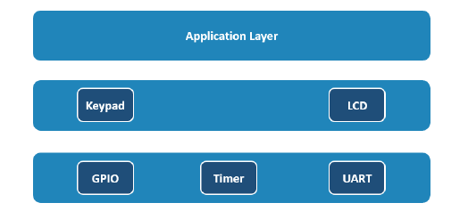
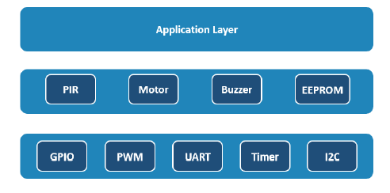
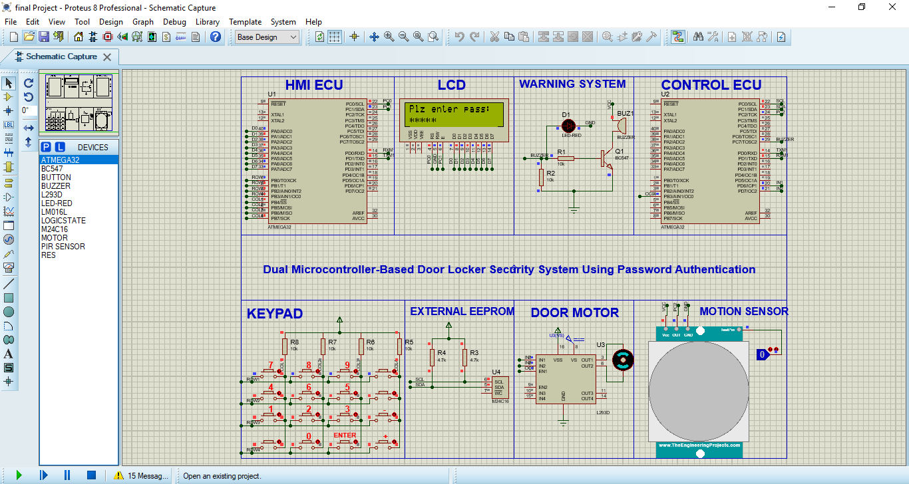

# 🔐 Dual MCU Door Locker System (ATmega32)

A dual microcontroller-based smart door locker system using ATmega32.  
The system provides secure password authentication, UART communication between two ECUs, external EEPROM storage via I2C, motor-based door control, PIR motion detection, buzzer alerts, and a layered embedded software architecture.

---

## 📌 Project Overview

This project is designed using two microcontrollers:

### 🧠 HMI_ECU (Human Machine Interface)
- LCD display for system messages.
- 4x4 Keypad for password entry.
- Sends user commands and passwords to Control_ECU using UART.

### ⚙️ Control_ECU
- Validates passwords stored in external EEPROM.
- Controls the door motor using H-bridge.
- Monitors motion using PIR sensor.
- Activates buzzer for security alerts.

Both ECUs communicate using UART protocol.

---

## 🚀 Features

- 🔐 Password authentication system.
- 🔄 UART communication between two microcontrollers.
- 💾 External EEPROM password storage using I2C.
- 🚪 Motorized door lock/unlock control.
- 👁 PIR motion detection.
- 🔔 Buzzer alert for security violations.
- ⏱ Timer-based delays and system timing.
- 🧱 Layered embedded software architecture.
- 🔒 System lock after three failed password attempts.

---

## 🧩 Hardware Components

### HMI_ECU
- ATmega32 Microcontroller  
- 16x2 LCD Display (8-bit mode)  
- 4x4 Keypad  
- UART Interface  

### Control_ECU
- ATmega32 Microcontroller  
- External EEPROM (I2C)  
- DC Motor with H-Bridge Driver  
- PIR Motion Sensor  
- Buzzer  
- UART Interface  

---

## 🗂 Project Structure
dual-mcu-door-locker-system
│
├── HMI_ECU
│   ├── keypad.c / keypad.h
│   ├── lcd.c / lcd.h
│   ├── uart.c / uart.h
│   └── HMI_ECU.c
│
├── Control_ECU
│   ├── external_eeprom.c / .h
│   ├── pwm_timer.c / .h
│   ├── dc_motor.c / .h
│   ├── pir.c / .h
│   ├── buzzer.c / .h
│   └── control_ecu.c
│
├── docs
│   ├── HMI_architecture.jpg
│   ├── Control_architecture.jpg
│   └── simulation.jpg
│
└── proteus
---

## 🖼 Project Images

### 🔹 System Architecture (HMI ECU)

---

### 🔹 System Architecture (Control ECU)

---

### 🔹 Proteus Simulation

---

## ⚙️ System Specifications

- Microcontroller: ATmega32  
- System Frequency: 8 MHz  
- Communication Protocol: UART  
- EEPROM Interface: I2C  
- Motor Control: PWM (Timer0)  
- Software Architecture: Layered Architecture  

---
